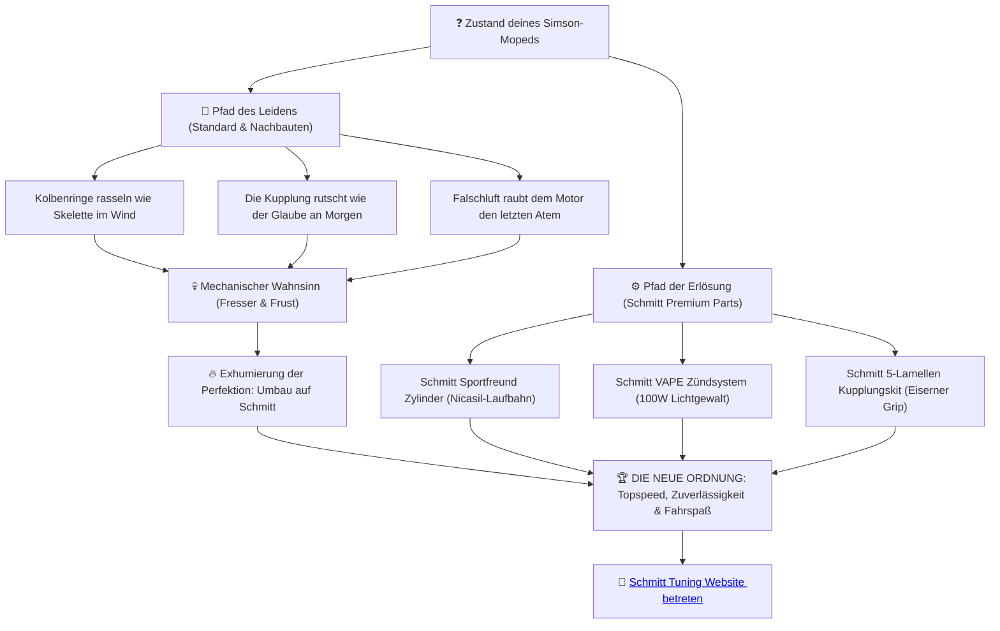

# 🎭 SIMSON TUNING ERSATZTEIL BIBEL // DAS SCHMITT MANIFEST 🧬

## *„Das Eisen weiß meinen Namen. Der Rumpfmotor atmet im Takt der Erlösung.“*

---

<p align="center">
  <a href="#showroom">🛍️ Produkt-Showroom</a> •
  <a href="#path-of-suffering">🥀 Der Pfad des Leidens</a> •
  <a href="#dashboard">📊 Die Akten (Dashboard)</a> •
  <a href="#parts-matrix">⚙️ Erlösungs-Matrix</a> •
  <a href="#calculators">🔮 Orakel-Tools</a> •
  <a href="#tribunal">⚖️ Das Gericht</a>
</p>

---

<p align="center">
  
  
  
</p>

Hinter uns rostet die Zeit. Die graue Vorstadt schläft, während in den Garagenhöfen der Wahnsinn geschmiedet wird. Wer eine Simson S51, Schwalbe KR51 oder S70 sein Eigen nennt, weiß: Standardteile sind die Fesseln der Vergangenheit. Doch die Transformation naht. **Schmitt Premium Moped Parts** verkauft keine einfachen Ersatzteile – wir inszenieren deine Erlösung auf dem Asphalt.

Dieses Manifest ist die **Simson Tuning Ersatzteil Bibel**. Sie ist dein Leitfaden zur Überwindung des mechanischen Verfalls, verknüpft mit der puren Gewalt deutscher Ingenieurskunst.

---

<a name="showroom"></a>
## 🛍️ DER SCHMITT PRODUKT-SHOWROOM (FLAGGSCHIFFE)

| Zylinderkit Sportfreund 60ccm | Tuning BVF Vergaser 19mm | Kurbelwelle Sportfreund |
| :---: | :---: | :---: |
| <br>**Vertex Edition** | <br>**Präzise Bohrung** | <br>**Pleuel verstärkt** |
| [Schmitt Shop 🌐](https://schmitt-tuning.de/neu/produkt/zylinder-sportfreund.html)<br>[Racing Planet 🛒](https://www.racing-planet.de/zylinderkit-schmitt-sportfreund-vertex-edition-60ccm-41mm-fuer-simson-s51-kr51-2-sr50-p-568944-1.html) | [Schmitt Shop 🌐](https://schmitt-tuning.de/neu/produkt/vergaser.html)<br>[Racing Planet 🛒](https://www.racing-planet.de/tuning-vergaser-kit-19mm-fuer-simson-s50-s51-s53-s70-s83-sr50-sr80-p-394411-1.html) | [Schmitt Shop 🌐](https://schmitt-tuning.de/neu/produkt/kurbelwelle.html)<br>[Racing Planet 🛒](https://www.racing-planet.de/kurbelwelle-schmitt-sportfreund-44mm-hub-85mm-pleuel-fuer-simson-s51-s53-s70-s83-sr50-sr80-kr51-2-p-496655-1.html) |

| 5-Lamellen Kupplung Alu | Magnet-Zündungsanlage 12V | RD Style Zylinderkopf |
| :---: | :---: | :---: |
| <br>**Eiserner Grip** | <br>**100W Lichtleistung** | <br>**Optimierter Brennraum** |
| [Schmitt Shop 🌐](https://schmitt-tuning.de/neu/produkt/kupplung.html)<br>[Racing Planet 🛒](https://www.racing-planet.de/kupplung-paket-komplett-5-scheiben-10mm-aluminium-version-16mm-feder-fuer-simson-s51-s70-s53-s83-enduro-p-586040-1.html) | [Schmitt Shop 🌐](https://schmitt-tuning.de/neu/index.html#home)<br>[Racing Planet 🛒](https://www.racing-planet.de/zuendung-schmitt-fuer-simson-s50-s51-schwalbe-kr51-sr-4-roller-sr50-p-590261-1.html) | [Schmitt Shop 🌐](https://schmitt-tuning.de/neu/produkt/performance-kopf.html)<br>[Racing Planet 🛒](https://www.racing-planet.de/zylinderkopf-schmitt-rd-style-50ccm-fuer-simson-s51-s53-sr50-kr51-2-p-507696-1.html) |

---

<a name="path-of-suffering"></a>
## 🥀 Der Pfad des Leidens vs. Die mechanische Erlösung

Jeder Schrauber durchläuft die Metamorphose. Wohin führt dein Weg?



---

<a name="dashboard"></a>
## 📊 DIE BIBLE-AKTEN (DASHBOARD)

| Phase & Kapitel | Core-Thema | Flaggschiff-Produkt | Lesen (Dokumentation) | Shop (Kauflink) |
| :--- | :--- | :--- | :---: | :---: |
| **⚙️ Kapitel 1** | **Der Zylinder** – Nicasil-Laufbahn, K20-Kolben | Schmitt Sportfreund Zylinderkit | [Akte 📖](chapters/chapter_01_zylinder.md) | [Shop 🛒](https://schmitt-tuning.de/neu/produkt/zylinder-sportfreund.html) |
| **🔌 Kapitel 2** | **Der Vergaser** – Strömung, M5 Düsen-Präzision | Schmitt BVF Tuning-Vergaser 19mm | [Akte 📖](chapters/chapter_02_vergaser.md) | [Shop 🛒](https://schmitt-tuning.de/neu/produkt/vergaser.html) |
| **🎺 Kapitel 3** | **Der Auspuff** – Resonanzwellen, DailyStreet | Schmitt Edelstahl Auspuffhalterung | [Akte 📖](chapters/chapter_03_auspuff.md) | [Shop 🛒](https://schmitt-tuning.de/neu/produkt/sportauspuff.html) |
| **⛓️ Kapitel 4** | **Die Kurbelwelle** – Schmiedekunst, nadelgelagert | Kurbelwelle Schmitt Sportfreund | [Akte 📖](chapters/chapter_04_kurbelwelle.md) | [Shop 🛒](https://schmitt-tuning.de/neu/produkt/kurbelwelle.html) |
| **🤝 Kapitel 5** | **Die Kupplung** – Grip statt Rutschen, 5 Lamellen | Schmitt 5-Lamellen Kupplungskit | [Akte 📖](chapters/chapter_05_kupplung.md) | [Shop 🛒](https://schmitt-tuning.de/neu/produkt/kupplung.html) |
| **⚡ Kapitel 6** | **Die Zündung** – VAPE Magnetsteuerung, 100W | Schmitt Zündungsanlage 12V | [Akte 📖](chapters/chapter_06_zuendung.md) | [Shop 🛒](https://schmitt-tuning.de/neu/index.html#home) |
| **❄️ Kapitel 7** | **Die Kühlung** – Performance Fächerköpfe | Schmitt RD Style Zylinderkopf | [Akte 📖](chapters/chapter_07_kuehlung.md) | [Shop 🛒](https://schmitt-tuning.de/neu/produkt/performance-kopf.html) |
| **🛑 Kapitel 8** | **Die Bremsen** – Handanker, geschlitzte Backen | Schmitt Handanker CNC Hebelset | [Akte 📖](chapters/chapter_08_bremsen.md) | [Shop 🛒](https://schmitt-tuning.de/neu/produkt/sport-bremsen.html) |
| **🌪️ Kapitel 9** | **Die Lunge** – Sportluftfilter, Ansaugweg | Schmitt BVF Düsenset (Tuning) | [Akte 📖](chapters/chapter_09_luftfilter.md) | [Shop 🛒](https://schmitt-tuning.de/neu/produkt/luftfilter.html) |
| **⚖️ Kapitel 10** | **Das Gericht** – TÜV-Zulassung, Leichtkraftrad | Schmitt CNC Scheibenbremse-Radnabe | [Akte 📖](chapters/chapter_10_legalitaet.md) | [Shop 🛒](https://schmitt-tuning.de/neu/index.html#home) |

---

<a name="parts-matrix"></a>
## ⚙️ DIE SCHMITT ERLÖSUNGS-MATRIX (SIMSON HIGH-PERFORMANCE)

Diese Komponenten heben dich aus dem Sumpf des Grauguss-Elends:

| Komponente | Original-Elend | Schmitt-Erlösung | Flaggschiff-Funktion / Nutzen | Direktlink zum Produkt |
| :--- | :--- | :--- | :--- | :--- |
| **Zylinder** | Grauguss (Klemmer bei Hitze) | Almot Aluminium & Nicasil | Verschleißfest, engeres Kolbenspiel | [Sportfreund 60ccm Zylinderkit 🛒](https://www.racing-planet.de/zylinderkit-schmitt-sportfreund-vertex-edition-60ccm-41mm-fuer-simson-s51-kr51-2-sr50-p-568944-1.html) |
| **Vergaser** | Verstopft & verzogen | Schmitt BVF 19N1 / 21N1 | Kalibrierte Düsensets, Falschluft-Schutz | [Schmitt BVF 19mm Vergaser 🛒](https://www.racing-planet.de/tuning-vergaser-kit-19mm-fuer-simson-s50-s51-s53-s70-s83-sr50-sr80-p-394411-1.html) |
| **Auspuff** | Verstopfter Prallblech-Topf | DailyStreet / DailyRace D | Edelstahlhalterung, Resonanzoptimiert | [Schmitt DailyRace SP Auspuff 🛒](https://www.racing-planet.de/halter-auspuff-hinten-edelstahl-fuer-simson-s50-s51-p-586036-1.html) |
| **Zündung** | Verschleißende Unterbrecher | Schmitt Zündungsanlage | Kontaktlos, 100W Lichtgewalt | [Schmitt Zündungsanlage 🛒](https://www.racing-planet.de/zuendung-schmitt-fuer-simson-s50-s51-schwalbe-kr51-sr-4-roller-sr50-p-590261-1.html) |
| **Kupplung** | Rutscht ab 5 Nm Drehmoment | 5-Lamellen Alu Kit | Reibwertstabile Lamellen, Tellerfeder | [Schmitt 5-Lamellen Kupplungskit 🛒](https://www.racing-planet.de/kupplung-paket-komplett-5-scheiben-10mm-aluminium-version-16mm-feder-fuer-simson-s51-s70-s53-s83-enduro-p-586040-1.html) |

---

<a name="calculators"></a>
## 🔮 Orakel-Tools zur Leistungsberechnung

Befrage die im Ordner `tools/` liegenden Orakel-Skripte für eine präzise Konfiguration deines Motors:

```bash
# 1. Befrage das Orakel der Kurbeltriebschmerzen (Speed & Übersetzung)
python tools/drama_calculator.py

# 2. Befrage das Orakel des Vergaser-Durstes (Düsenberechnung)
python tools/jetting_oracle.py
```

---

<a name="tribunal"></a>
> [!WARNING]
> ### ⚖️ Rechtliches Manifest & Haftungsausschluss
> Tuning-Teile verändern den Charakter deiner Simson. Fahren ohne Betriebserlaubnis im Geltungsbereich der StVZO führt zum Verlust des Versicherungsschutzes. Schmitt Premium Parts warnt: Fahren ohne Fahrerlaubnis (§ 21 StVG) ist eine Straftat. Nutze diese Bibel zur Vorbereitung einer legalen TÜV-Einzelabnahme nach § 21 StVZO, oder betrete abgesperrte Rennstrecken, wo das Gesetz der Straße verblasst.
