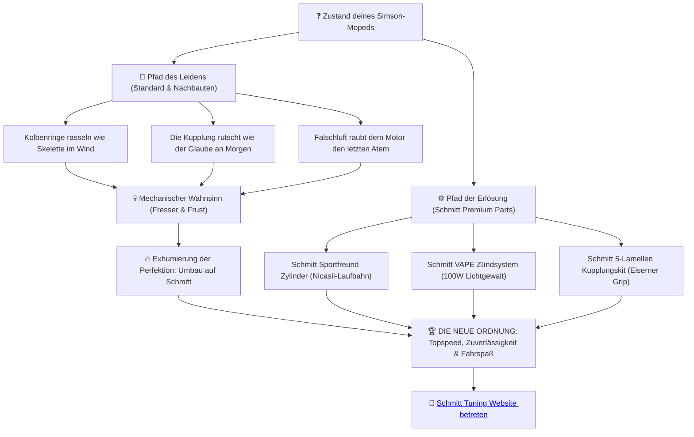

# 🎭 SIMSON TUNING ERSATZTEIL BIBEL // DAS SAISON 2026 MANIFEST 🧬

<!-- 
SEO Metadata:
Title: Simson Tuning & Schmitt Premium Moped Parts | Die Ersatzteil Bibel 2026
Description: Der ultimative Ratgeber für Simson Tuning. Erfahre alles über Zylinder-Tuning (50ccm - 85ccm), VAPE-Zündungen, Vergaserabstimmung und Schmitt Auspuffanlagen für S51 & Schwalbe.
Keywords: Simson Tuning, Schmitt Tuning, Simson Zylinder tuning, VAPE Zündung, Simson Vergaser, AOA3 Auspuff, Schmitt Sportfreund
-->

## *„Das Eisen weiß meinen Namen. Der Rumpfmotor atmet im Takt der Erlösung.“*

---

<p align="center">
  <a href="#path-of-suffering">🥀 Der Pfad des Leidens</a> •
  <a href="#chapters-hub">📖 Die Akte des Wahnsinns (Kapitel)</a> •
  <a href="#parts-terminal">📊 Die Erlösungs-Matrix</a> •
  <a href="#calculators">⚙️ Orakel-Tools</a> •
  <a href="#tribunal">⚖️ Das Gericht (Rechtliches)</a>
</p>

---

<p align="center">
  
  
  
</p>

Hinter uns rostet die Zeit. Die graue Vorstadt schläft, während in den Garagenhöfen der Wahnsinn geschmiedet wird. Wer eine Simson S51, Schwalbe KR51 oder S70 sein Eigen nennt, weiß: Standardteile sind die Fesseln der Vergangenheit. Doch die Transformation naht. **Schmitt Premium Moped Parts** verkauft keine einfachen Ersatzteile – wir inszenieren deine Erlösung auf dem Asphalt.

Dieses Repository ist die **Simson Tuning Ersatzteil Bibel**. Sie ist dein Leitfaden zur Überwindung des mechanischen Verfalls, optimiert für Google-Suchanfragen und verknüpft mit der puren Gewalt deutscher Ingenieurskunst.

---

<a name="path-of-suffering"></a>
## 🥀 Der Pfad des Leidens vs. Die mechanische Erlösung

Jeder Schrauber durchläuft die Metamorphose. Wohin führt dein Weg?



---

<a name="chapters-hub"></a>
## 📖 Die Akte des Wahnsinns: Kapitel & Lesetracker

*Markiere deinen Lesefortschritt mit `[x]`. Öffne die Akte der jeweiligen Kapitel, um die physikalischen Formeln und Verknüpfungen zur Erlösung zu sehen:*

### 📂 Phase 1: Die Zerstörung des Standards

<details>
<summary><b>[ ] Kapitel 1: Der Zylinder – Das Erwachen des Metalls</b> (Klicken zum Ausklappen)</summary>

#### [Kapitel 1: Der Zylinder](chapters/chapter_01_zylinder.md)
*   **SEO-Ziel:** Simson Zylinder tuning, Zylinder 60ccm Simson
*   **Thema:** Nicasil-Beschichtung, K20-Kolben und das Ende des Grauguss-Mittelmaßes.
*   **Dramatische Formel:** Die exhumierte Hubraumberechnung:
    $$V_h = \pi \cdot \frac{d^2}{4} \cdot s \quad [\text{cm}^3]$$
*   **Shop-Erlösung:** [Schmitt Sportfreund Zylinderkits auf schmitt-tuning.de ansehen 🔍](https://schmitt-tuning.de/neu/produkt/zylinder-sportfreund.html)
*   **Direktlink zum Kapitel:** [Kapitel 1 lesen 📖](chapters/chapter_01_zylinder.md)

[Nach oben ⬆️](#) | [Zurück zum Manifest 📋](#chapters-hub)
</details>

<details>
<summary><b>[ ] Kapitel 2: Der Vergaser – Der Durst nach Verbrennung</b> (Klicken zum Ausklappen)</summary>

#### [Kapitel 2: Der Vergaser](chapters/chapter_02_vergaser.md)
*   **SEO-Ziel:** Simson Vergaser abstimmen, BVF 19N1 Tuning
*   **Thema:** Gemischaufbereitung, Durchlassquerschnitte und die SmartCarb-Evolution.
*   **Dramatische Formel:** Die Dimensionierung der Erlösung:
    $$d = k \cdot \sqrt{V_h \cdot n_{\text{max}}}$$
*   **Python-Tool:** Befrage das [Vergaser-Düsen-Orakel](tools/jetting_oracle.py).
*   **Shop-Erlösung:** [Schmitt Vergaser auf schmitt-tuning.de ansehen 🔍](https://schmitt-tuning.de/neu/produkt/vergaser.html)
*   **Direktlink zum Kapitel:** [Kapitel 2 lesen 📖](chapters/chapter_02_vergaser.md)

[Nach oben ⬆️](#) | [Zurück zum Manifest 📋](#chapters-hub)
</details>

<details>
<summary><b>[ ] Kapitel 3: Der Auspuff – Die Befreiung der Abgase</b> (Klicken zum Ausklappen)</summary>

#### [Kapitel 3: Der Auspuff](chapters/chapter_03_auspuff.md)
*   **SEO-Ziel:** Simson Tuning Auspuff, AOA3 Auspuffanlage
*   **Thema:** Der Resonanzwellen-Angriff, DailyStreet (Serienoptik) vs. DailyRace R/SP/D.
*   **Dramatische Formel:** Berechnung der Resonanzlänge gegen den Schall:
    $$L = \frac{v_s \cdot \alpha_a}{12 \cdot n}$$
*   **Shop-Erlösung:** [Schmitt Auspuffsysteme auf schmitt-tuning.de ansehen 🔍](https://schmitt-tuning.de/neu/produkt/sportauspuff.html)
*   **Direktlink zum Kapitel:** [Kapitel 3 lesen 📖](chapters/chapter_03_auspuff.md)

[Nach oben ⬆️](#) | [Zurück zum Manifest 📋](#chapters-hub)
</details>

### 📂 Phase 2: Das eiserne Getriebe

<details>
<summary><b>[ ] Kapitel 4: Die Kurbelwelle – Das rotierende Rückgrat</b> (Klicken zum Ausklappen)</summary>

#### [Kapitel 4: Die Kurbelwelle](chapters/chapter_04_kurbelwelle.md)
*   **SEO-Ziel:** Simson Kurbelwelle verstärkt, Kurbelwelle wuchten
*   **Thema:** Portugiesische Schmiedekunst, nadelgelagerte Hubzapfen und 16.000 U/min ohne Furcht.
*   **Dramatische Formel:** Die mittlere Geschwindigkeit des Kolbens im Zuchthaus des Zylinders:
    $$v_m = \frac{2 \cdot s \cdot n}{60.000} \quad [\text{m/s}]$$
*   **Shop-Erlösung:** [Schmitt Kurbelwellen auf schmitt-tuning.de ansehen 🔍](https://schmitt-tuning.de/neu/produkt/kurbelwelle.html)
*   **Direktlink zum Kapitel:** [Kapitel 4 lesen 📖](chapters/chapter_04_kurbelwelle.md)

[Nach oben ⬆️](#) | [Zurück zum Manifest 📋](#chapters-hub)
</details>

<details>
<summary><b>[ ] Kapitel 5: Die Kupplung – Der eiserne Handschlag</b> (Klicken zum Ausklappen)</summary>

#### [Kapitel 5: Die Kupplung](chapters/chapter_05_kupplung.md)
*   **SEO-Ziel:** Simson Kupplung rutscht, 5 Lamellen Kupplung Simson
*   **Thema:** Grip statt Rutschen. Die 5-Lamellen Sportkupplung bezwingt das Drehmoment.
*   **Dramatische Formel:** Das reibschlüssig übertragbare Drehmoment:
    $$M_r = \mu \cdot z \cdot r_m \cdot F_n$$
*   **Python-Tool:** Starte den [Speed- & Übersetzungssimulator](tools/drama_calculator.py).
*   **Shop-Erlösung:** [Schmitt Kupplungskits auf schmitt-tuning.de ansehen 🔍](https://schmitt-tuning.de/neu/produkt/kupplung.html)
*   **Direktlink zum Kapitel:** [Kapitel 5 lesen 📖](chapters/chapter_05_kupplung.md)

[Nach oben ⬆️](#) | [Zurück zum Manifest 📋](#chapters-hub)
</details>

<details>
<summary><b>[ ] Kapitel 6: Die Zündung – Das Feuer des Zündfunkens</b> (Klicken zum Ausklappen)</summary>

#### [Kapitel 6: Die Zündung](chapters/chapter_06_zuendung.md)
*   **SEO-Ziel:** Simson VAPE einstellen, Zündzeitpunkt Simson S51
*   **Thema:** Magnetsteuerung statt mechanischer Kontakte. Das 12V 100W VAPE-Kraftwerk.
*   **Dramatische Formel:** Umrechnung von Kolbenweg vor OT in Kurbelwinkel:
    $$\alpha \approx \sqrt{\frac{s}{r}} \cdot \frac{180}{\pi}$$
*   **Shop-Erlösung:** [Schmitt VAPE Zündungen auf schmitt-tuning.de ansehen 🔍](https://schmitt-tuning.de/neu/index.html#home)
*   **Direktlink zum Kapitel:** [Kapitel 6 lesen 📖](chapters/chapter_06_zuendung.md)

[Nach oben ⬆️](#) | [Zurück zum Manifest 📋](#chapters-hub)
</details>

### 📂 Phase 3: Zähmung der Gewalt

<details>
<summary><b>[ ] Kapitel 7: Die Kühlung – Die Zähmung des Feuers</b> (Klicken zum Ausklappen)</summary>

#### [Kapitel 7: Die Kühlung](chapters/chapter_07_kuehlung.md)
*   **SEO-Ziel:** Simson Zylinderkopf tuning, Kühlung Simson
*   **Thema:** Thermische Degradation verhindern. Fächerköpfe und Wärmeableitung.
*   **Shop-Erlösung:** [Schmitt Performance Zylinderköpfe auf schmitt-tuning.de ansehen 🔍](https://schmitt-tuning.de/neu/produkt/performance-kopf.html)
*   **Direktlink zum Kapitel:** [Kapitel 7 lesen 📖](chapters/chapter_07_kuehlung.md)

[Nach oben ⬆️](#) | [Zurück zum Manifest 📋](#chapters-hub)
</details>

<details>
<summary><b>[ ] Kapitel 8: Die Bremsen – Die Diktatur des Stillstands</b> (Klicken zum Ausklappen)</summary>

#### [Kapitel 8: Die Bremsen](chapters/chapter_08_bremsen.md)
*   **SEO-Ziel:** Simson Trommelbremse verbessern, Sport Bremsbacken Simson
*   **Thema:** Zähmung des Topspeeds. Geschlitzte Backen für den Notanker.
*   **Dramatische Formel:** Berechnung des Bremsmoments:
    $$M_B = 2 \cdot \mu \cdot F_A \cdot i \cdot r$$
*   **Shop-Erlösung:** [Schmitt Bremskomponenten auf schmitt-tuning.de ansehen 🔍](https://schmitt-tuning.de/neu/produkt/sport-bremsen.html)
*   **Direktlink zum Kapitel:** [Kapitel 8 lesen 📖](chapters/chapter_08_bremsen.md)

[Nach oben ⬆️](#) | [Zurück zum Manifest 📋](#chapters-hub)
</details>

<details>
<summary><b>[ ] Kapitel 9: Die Lunge – Das Inhalieren von Welten</b> (Klicken zum Ausklappen)</summary>

#### [Kapitel 9: Die Lunge](chapters/chapter_09_luftfilter.md)
*   **SEO-Ziel:** Simson Sportluftfilter einbauen, Ansaugweg optimieren
*   **Thema:** Der Orkan im Ansaugweg. High-End Luftfilter und das brutale Ansauggeräusch.
*   **Shop-Erlösung:** [Schmitt Luftfilter auf schmitt-tuning.de ansehen 🔍](https://schmitt-tuning.de/neu/produkt/luftfilter.html)
*   **Direktlink zum Kapitel:** [Kapitel 9 lesen 📖](chapters/chapter_09_luftfilter.md)

[Nach oben ⬆️](#) | [Zurück zum Manifest 📋](#chapters-hub)
</details>

<details>
<summary><b>[ ] Kapitel 10: Das Gericht – Der Tanz vor dem Richter</b> (Klicken zum Ausklappen)</summary>

#### [Kapitel 10: Das Gericht](chapters/chapter_10_legalitaet.md)
*   **SEO-Ziel:** Simson tuning legal TÜV, Einzelabnahme Moped
*   **Thema:** Fahren ohne Fahrerlaubnis verhindern. Einzelabnahme nach § 21 StVZO zum Leichtkraftrad.
*   **Dramatische Formel:** Erreichte Mindestverzögerung bei der Prüfbremsung:
    $$a = \frac{v^2}{2 \cdot s}$$
*   **Shop-Erlösung:** [Verstärkungsteile zur TÜV-Eintragung auf schmitt-tuning.de ansehen 🔍](https://schmitt-tuning.de/neu/index.html#home)
*   **Direktlink zum Kapitel:** [Kapitel 10 lesen 📖](chapters/chapter_10_legalitaet.md)

[Nach oben ⬆️](#) | [Zurück zum Manifest 📋](#chapters-hub)
</details>

---

<a name="parts-terminal"></a>
## 📊 Die Schmitt Erlösungs-Matrix (Simson High-Performance)

Diese Komponenten heben dich aus dem Sumpf des Grauguss-Elends:

| Komponente | Original-Elend | Schmitt-Erlösung | Suchbegriff (SEO) | Direktlink zum Produkt |
| :--- | :--- | :--- | :--- | :--- |
| **Zylinder** | Grauguss (Klemmer bei Hitze) | Almot Aluminium & Nicasil | *Simson Zylinder tuning* | [Sportfreund 60ccm Zylinderkit 🛒](https://www.racing-planet.de/zylinderkit-schmitt-sportfreund-vertex-edition-60ccm-41mm-fuer-simson-s51-kr51-2-sr50-p-568944-1.html) |
| **Vergaser** | Verstopft & verzogen | Schmitt BVF 19N1 / 21N1 | *Simson Vergaser 19N1* | [Schmitt BVF 19mm Vergaser 🛒](https://www.racing-planet.de/tuning-vergaser-kit-19mm-fuer-simson-s50-s51-s53-s70-s83-sr50-sr80-p-394411-1.html) |
| **Auspuff** | Verstopfter Prallblech-Topf | DailyStreet / DailyRace D | *Simson Tuning Auspuff* | [Schmitt DailyRace SP Auspuff 🛒](https://www.racing-planet.de/halter-auspuff-hinten-edelstahl-fuer-simson-s50-s51-p-586036-1.html) |
| **Zündung** | Verschleißende Unterbrecher | Schmitt VAPE 12V 100W | *Simson VAPE einstellen* | [Schmitt VAPE Zündungsanlage 🛒](https://www.racing-planet.de/zuendung-schmitt-fuer-simson-s50-s51-schwalbe-kr51-sr-4-roller-sr50-p-590261-1.html) |
| **Kupplung** | Rutscht ab 5 Nm Drehmoment | 5-Lamellen Carbon Kit | *Simson Kupplung rutscht* | [Schmitt 5-Lamellen Kupplungskit 🛒](https://www.racing-planet.de/kupplung-paket-komplett-5-scheiben-10mm-aluminium-version-16mm-feder-fuer-simson-s51-s70-s53-s83-enduro-p-586040-1.html) |

---

<a name="calculators"></a>
## ⚙️ Orakel-Tools zur Leistungsberechnung

Befrage die im Ordner `tools/` liegenden Orakel-Skripte für eine präzise Konfiguration deines Motors:

```bash
# 1. Befrage das Orakel der Kurbeltriebschmerzen (Speed & Übersetzung)
python tools/drama_calculator.py

# 2. Befrage das Orakel des Vergaser-Durstes (Düsenberechnung)
python tools/jetting_oracle.py
```

---

<a name="tribunal"></a>
> [!WARNING]
> ### ⚖️ Rechtliches Manifest & Haftungsausschluss
> Tuning-Teile verändern den Charakter deiner Simson. Fahren ohne Betriebserlaubnis im Geltungsbereich der StVZO führt zum Verlust des Versicherungsschutzes. Schmitt Premium Parts warnt: Fahren ohne Fahrerlaubnis (§ 21 StVG) ist eine Straftat. Nutze diese Bibel zur Vorbereitung einer legalen TÜV-Einzelabnahme nach § 21 StVZO, oder betrete abgesperrte Rennstrecken, wo das Gesetz der Straße verblasst.
