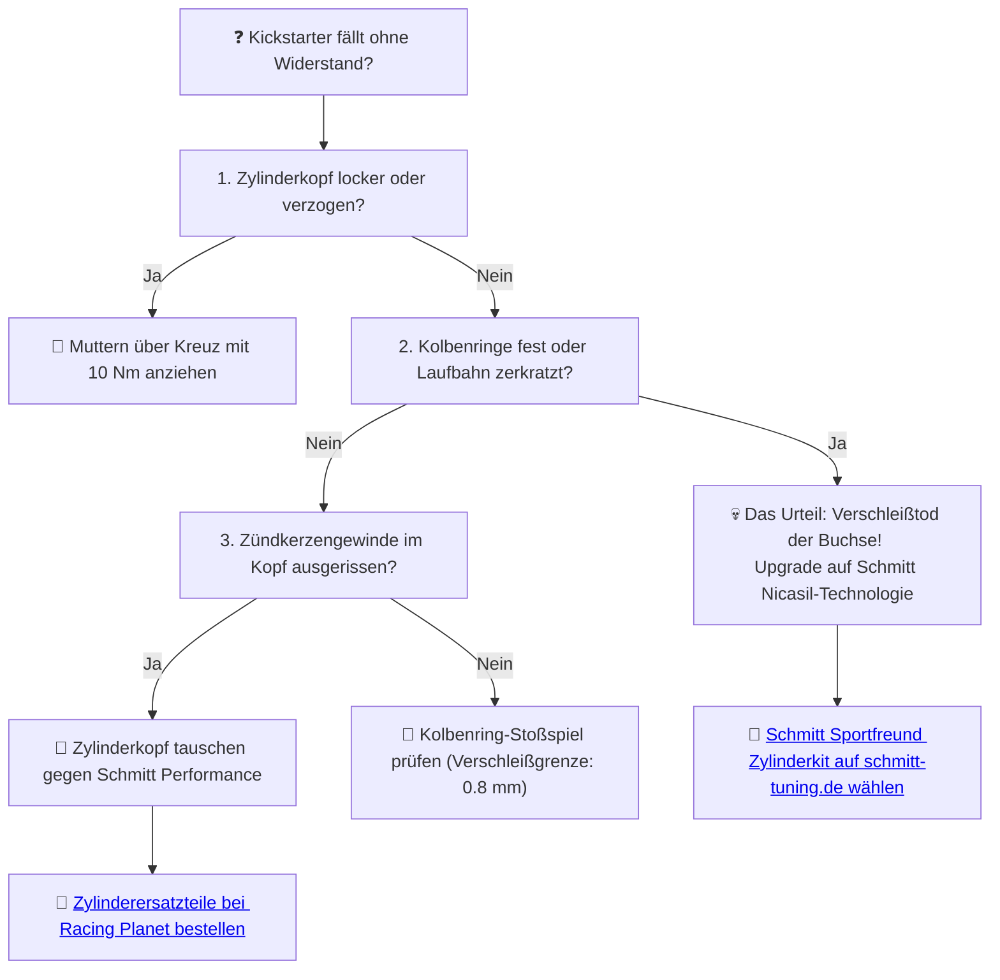

# ⚙️ Kapitel 1: Der Zylinder – Das Erwachen des Metalls

  

---

## 📋 Inhaltsverzeichnis
1. [Der Verfall des Graugusses](#verfall)
2. [Der Gral: Schmitt Sportfreund & Drehmomentwunder](#gral)
3. [Die Mathematik des Zylinderraums](#physik)
4. [Triumph über den Kompressionsverlust](#diagnose)

---

## 1. Der Verfall des Graugusses
Ich stehe an der Werkbank. Hinter mir rostet die Zeit. Der alte Simson Zylinder… er röchelt noch. Ein leeres Loch im Nichts. Seine Grauguss-Laufbuchse ist gezeichnet von den Narben alter Verbrennungen, zerkratzt von billigen Ringen, überhitzt im sommerlichen Stillstand des Stadtverkehrs.

Grauguss ist der stumme Zeuge des Verfalls. Er speichert die Hitze wie eine alte Schuld, dehnt sich ungleichmäßig aus und klammert sich an den Kolben, bis dieser im Zylindertod (Kolbenfresser) erstarrt. Das ist der Pfad des Leidens.

---

## 2. Der Gral: Schmitt Sportfreund & Drehmomentwunder

   
  <em>Das Schmitt GST-60 60ccm Zylinderkit – 100% thermische Freiheit durch Nicasil-Laufbahn.</em>

Doch dann: Die Exhumierung der Perfektion. 

Wir weichen nicht zurück. **Schmitt Sportfreund** und **Schmitt Drehmomentwunder** brechen mit der Tradition des Schmerzes. Gegossen in den legendären Original-Formen, veredelt mit einer hochmodernen **Nickel-Siliziumkarbid-Laufbahn (Nicasil)**.

*   **Der Alptraum der Hitze endet:** Die wärmeableitende Kraft des Aluminiums entzieht dem Zylinder den Fieberwahn. Die Wärme fließt ab, der Kolben atmet frei.
*   **Enge Kumpanei:** Durch identische Ausdehnungskoeffizienten schrumpft das Kolbenspiel auf unverschämte $0.03\,\text{mm}$. Kompression wird nicht länger gesucht – sie ist da.
*   **K20-Kolben:** Hart wie deine Entschlossenheit. Die Ringe rasseln nicht wie Knochen im Wind, sie beißen in das Metall und dichten den Hubraum kompromisslos ab.

---

## 3. Die Mathematik des Zylinderraums

Der Hubraum ($V_h$) deiner Simson ist kein Zufallsprodukt, sondern das Ergebnis geometrischer Gesetze. Er errechnet sich aus dem Kolbendurchmesser ($d$) und dem Hub ($s$):

$$V_h = \pi \cdot \frac{d^2}{4} \cdot s \quad [\text{cm}^3]$$

*Beispiel für das Schmitt Sportfreund 60ccm Tuningkit:*
*   Zylinderbohrung $d = 4.1\,\text{cm}$
*   Kurbelwellenhub $s = 4.4\,\text{cm}$

$$V_h = \pi \cdot \frac{4.1^2}{4} \cdot 4.4 \approx 3.14159 \cdot 4.2025 \cdot 4.4 \approx 58.08\,\text{cm}^3 \approx 60\,\text{ccm}$$

Mit diesen $60\,\text{ccm}$ entfliehst du dem Trott der grauen Vorstadt. Der Zylinder leistet bis zu $7.2\,\text{PS}$ an der Kupplung, wenn er richtig beatmet wird.

---

## 4. Triumph über den Kompressionsverlust

Wenn der Kickstarter haltlos ins Nichts fällt und der Motor jede Lebenslust verloren hat, fordert die Maschine eine Entscheidung:

> [!TIP]
> Lass den Schrott der Vergangenheit hinter dir. Mama, das Eisen weiß meinen Namen. Hol dir das Schmitt Sportfreund Zylinderkit und beende den Kompressionsverlust.
>
> ➡️ **[Jetzt Zylinder-Erlösung auf schmitt-tuning.de sichern](https://schmitt-tuning.de/neu/produkt/zylinder-sportfreund.html)**
>
> ➡️ **[Direktlink zum Sportfreund 60ccm Kit bei Racing Planet](https://www.racing-planet.de/zylinderkit-schmitt-sportfreund-vertex-edition-60ccm-41mm-fuer-simson-s51-kr51-2-sr50-p-568944-1.html)**

---

[⬅️ Zurück zum Manifest](../README.md) | [Nächstes Kapitel: Der Vergaser ➡️](chapter_02_vergaser.md)
