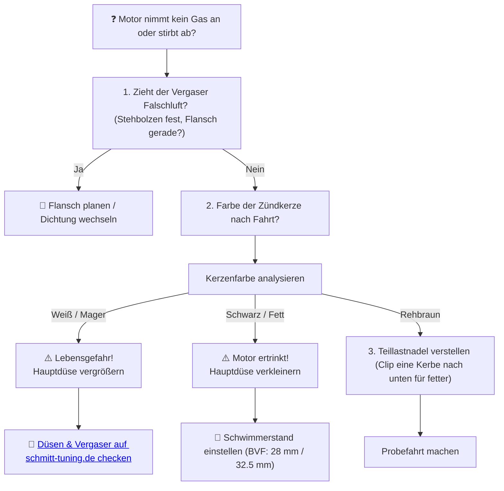

# 🔌 Kapitel 2: Der Vergaser – Der Durst nach Verbrennung

  
  
  

---

## 📋 Inhaltsverzeichnis
1. [Der trockene Schlund des Motors](#trockenheit)
2. [Die Flut: Schmitt Vergaser & M5 Düsen-Präzision](#flut)
3. [Die Gleichung des Querschnitts](#physik-vergaser)
4. [Erlösung vom unruhigen Leerlauf](#diagnose)

---

## 1. Der trockene Schlund des Motors
Ich starre auf den Schwimmer. Ein leeres Becken. Die Luft flimmert über dem heißen Asphalt. Der Motor verdurstet am Rand der Landstraße. Das Gemisch ist mager wie eine Lüge, die Nadel hängt im Nirgendwo fest, und der Zylinder wimmert um Kraftstoff.

Ein standardmäßiger BVF-Vergaser, vernachlässigt und verzogen, ist ein zahnloser Bettler. Er liefert nur ein tröpfelndes Rinnsal, wo ein reißender Strom fließen sollte. Die Folge: Magerlauf, Falschluft-Paranoia und der unvermeidliche Hitzetod des Zylinders.

---

## 2. Die Flut: Schmitt Vergaser & M5 Düsen-Präzision
Die Antwort auf den Durst lautet: **Schmitt Tuning-Vergaser**. 
Konstruiert mit dem Blick fürs Wesentliche. Perfekt gefräste Flansche, die Falschluft keine Chance geben, und eine präzise Bohrungs-Geometrie, die den Füllungsgrad maximiert.

*   **Der Orkan im Kanal:** In den Größen $16\,\text{mm}$, $19\,\text{mm}$ und $21\,\text{mm}$ lieferbar. Sie zwingen das Gemisch in die Knie und vernebeln es zu einem feinen Kraftstoffnebel.
*   **Schmitt M5 Düsensets:** Keine Toleranz-Abweichungen mehr. Wo andere Düsen beschriftet sind, aber abweichende Durchlässe aufweisen, liefert Schmitt kalibrierte Strömungsraten.

---

## 3. Die Gleichung des Querschnitts

Welcher Vergaserquerschnitt ($d$) gebührt deinem Triebwerk? Die Strömungsmechanik lehrt uns die Dimensionierung:

$$d = k \cdot \sqrt{V_h \cdot n_{\text{max}}} \quad [\text{mm}]$$

*   $V_h$: Hubraum in Litern
*   $n_{\text{max}}$: Drehzahl des Leistungsmaximums
*   $k$: Strömungsbeiwert ($0.75$ für sportliche Zweitakter)

*Berechnung für einen Schmitt 70ccm Zylinder bei 8.000 U/min:*
$$d = 0.75 \cdot \sqrt{0.07 \cdot 8000} = 0.75 \cdot \sqrt{560} \approx 0.75 \cdot 23.66 \approx 17.75\,\text{mm}$$

> [!NOTE]
> Ein 19mm Schmitt Vergaser ist der ideale Partner für dieses Setup. Er lässt den Motor atmen, ohne dass die Strömungsgeschwindigkeit im Teillastbereich einbricht.

---

## 4. Erlösung vom unruhigen Leerlauf

Wenn der Motor im Standgas abstirbt oder beim plötzlichen Gasgeben in ein tiefes Loch fällt, ist das Gemisch aus dem Gleichgewicht:

> [!TIP]
> Beende den Durst deines Motors. Mama, ich habe Durst nach mehr. Rüste jetzt auf den Schmitt BVF-Vergaser um und stimme ihn präzise ab.
>
> ➡️ **[Jetzt Vergaser-Erlösung auf schmitt-tuning.de sichern](https://schmitt-tuning.de/neu/index.html#vergaser)**
>
> ➡️ **[Direktlink zum Schmitt M5 Düsenset bei Racing Planet](https://www.racing-planet.de/xanario_search.php?query=schmitt+hauptduesen)**

---

[⬅️ Zurück zu Kapitel 1](chapter_01_zylinder.md) | [Hauptportal 📋](../README.md) | [Nächstes Kapitel: Der Auspuff ➡️](chapter_03_auspuff.md)
