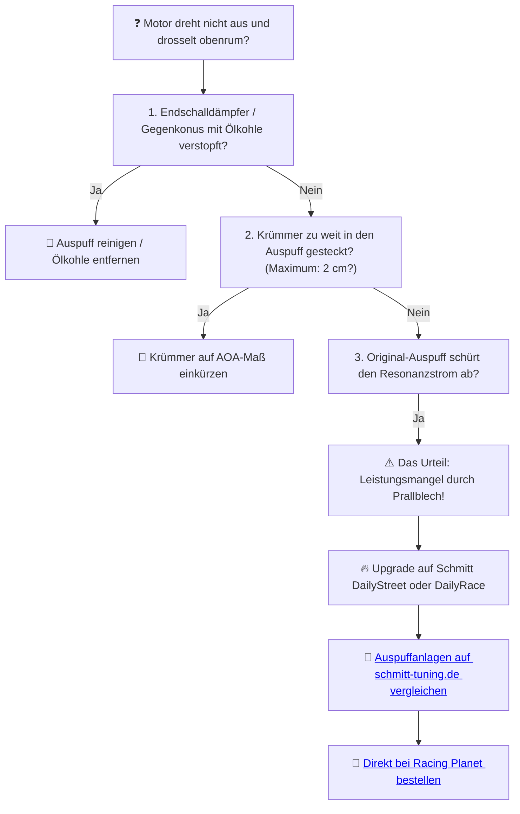

# 💨 Kapitel 3: Der Auspuff – Die Befreiung der Abgase

  
  
  

---

## 📋 Inhaltsverzeichnis
1. [Das Ersticken im Rohr](#ersticken)
2. [Die akustische Waffe: Schmitt DailyStreet & DailyRace](#waffe)
3. [Die Wellenphysik der Resonanz](#physik-auspuff)
4. [Diagnose: Abgasstau blockiert Drehzahlen](#diagnose)

---

## 1. Das Ersticken im Rohr
Ich höre ihn nicht mehr. Nur noch ein dumpfes, ersticktes Röcheln. Der originale Prallblechauspuff würgt den Zylinder ab. Der Staudruck frisst die Seele der Maschine, während das Frischgas ungenutzt ins Freie verpufft. Ein Gefängnis aus verkoktem Blech und Ölkohle.

Wo die Maschine schreien sollte, flüstert sie nur. Das ist der Pfad des Leidens. Wer den Auspuff nicht befreit, verdammt seinen Zylinder zu chronischer Trägheit.

---

## 2. Die akustische Waffe: Schmitt DailyStreet & DailyRace
Der akustische Gegenschlag folgt auf dem Fuße: **Schmitt Resonanzsysteme**. 
Gefertigt mit chirurgischer Präzision, um den Aufladungseffekt bei exakten Drehzahlen zu zünden.

*   **Schmitt DailyStreet:** Getarnt als Serienauspuff. Der Wolf im verchromten Schafspelz. Im Inneren arbeitet ein hochgradig effektiver Kegeldiffusor, der das Leistungsband breit fächert.
*   **Schmitt DailyRace (SP / R / D):** Das Blech wird zur Waffe. Drei verschiedene Längenkonfigurationen erlauben es, das Resonanzband punktgenau dorthin zu verschieben, wo dein Zylinder seine maximale Kraft entfaltet.

---

## 3. Die Wellenphysik der Resonanz

Die Schallgeschwindigkeit ($v_s$) im heißen Abgas beträgt ca. $520\,\text{m/s}$. Die Resonanzlänge ($L$) vom Kolben bis zum Gegenkonus bestimmt die Steuerzeit der Rücklaufwelle:

$$L = \frac{v_s \cdot \alpha_a}{12 \cdot n} \quad [\text{m}]$$

*   $\alpha_a$: Auslasssteuerzeit in Grad Kurbelwinkel
*   $n$: Zieldrehzahl des Motors

*Berechnung für den Schmitt DailyRace SP bei 8.500 U/min und einer Auslasszeit von 178 Grad:*
$$L = \frac{520 \cdot 178}{12 \cdot 8500} = \frac{92.560}{102.000} \approx 0.907\,\text{m} = 90.7\,\text{cm}$$

> [!IMPORTANT]
> Verändert man diesen Abstand (z. B. durch Auslassverschiebung oder Krümmerkürzung), verändert sich die Frequenz der Gassäule. Der Schmitt DailyRace bietet durch seine Schiebe-Konstruktion die Möglichkeit, diesen Bereich fein zu justieren.

---

## 4. Diagnose: Abgasstau blockiert Drehzahlen

Wenn dein Motor sich weigert, im oberen Drehzahlbereich frei auszudrehen, oder sich anfühlt wie verstopft:

> [!TIP]
> Resonanz ist kein Klang. Es ist ein Angriff auf den Asphalt. Mama, sie hören mich in anderen Städten. Hol dir die Schmitt DailyRace Auspuffanlage.
>
> ➡️ **[Jetzt Auspuff-Erlösung auf schmitt-tuning.de sichern](https://schmitt-tuning.de/neu/index.html#auspuff)**
>
> ➡️ **[Direktlink zu den Schmitt DailyRace Modellen bei Racing Planet](https://www.racing-planet.de/xanario_search.php?query=schmitt+dailyrace)**

---

[⬅️ Zurück zu Kapitel 2](chapter_02_vergaser.md) | [Hauptportal 📋](../README.md) | [Nächstes Kapitel: Die Kurbelwelle ➡️](chapter_04_kurbelwelle.md)
