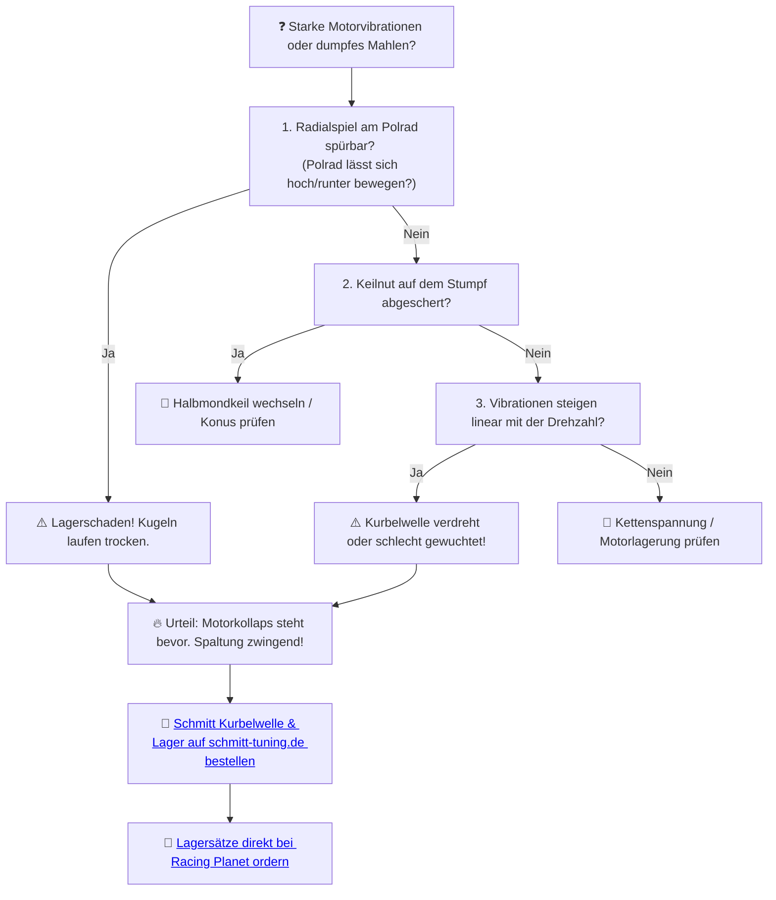

# ⚙️ Kapitel 4: Die Kurbelwelle – Das rotierende Rückgrat

  
  
  

---

## 📋 Inhaltsverzeichnis
1. [Der verbogene Pleuel im Fleisch der Maschine](#pleuel)
2. [Das neue Zentrum der Macht: Schmitt Sport-Kurbelwelle](#schmitt-welle)
3. [Die Reibung des Kolbenwegs](#physik-welle)
4. [Lagerung: Wenn das Gehäuse C3/C4 verlangt](#lagerung)
5. [Diagnose: Unwucht und Lagerschaden](#diagnose)

---

## 1. Der verbogene Pleuel im Fleisch der Maschine
Der Block ist offen. Ich blicke in den Abgrund des Kurbelgehäuses. Das originale Pleuel: Eine verbogene Nadel im zerschundenen Fleisch der Maschine. Die Unwucht des Alters lässt das gesamte Moped erzittern.

Bei Drehzahlen über $8.000\,\text{U/min}$ wird das Kurbelwellenlager zum Folterwerkzeug. Der Käfig zerbricht, Nadeln fressen sich durch die Überströmkanäle und zerstören das Zylinderkit. Das ist der Pfad des Leidens.

---

## 2. Das neue Zentrum der Macht: Schmitt Sport-Kurbelwelle

   
  <em>Kurbelwelle Schmitt Sportfreund – Portugiesische Schmiedekunst, bereit für 16.000 U/min.</em>

Die Implantation der Gewalt erfolgt durch die **Schmitt High-Performance Kurbelwelle**. 
Konstruiert mit nadelgelagerten Hubzapfen und geschmiedeten Hubscheiben.

*   **Der eiserne Stumpf:** Die Wangen sind feingewuchtet, um Vibrationen im Keim zu ersticken. Das schont deine Hände und die Lagerpassung des Motorgehäuses.
*   **Der Silberkäfig:** Das Pleuellager am Hubzapfen ist versilbert. Silber leitet die extreme Reibungshitze ab und schützt vor dem gefürchteten Lagertod im Sommer.

---

## 3. Die Reibung des Kolbenwegs

Die mittlere Kolbengeschwindigkeit ($v_m$) ist der Gradmesser für den Verschleiß deines Triebwerks. Sie berechnet sich nach:

$$v_m = \frac{2 \cdot s \cdot n}{60.000} \quad [\text{m/s}]$$

*   $s$: Hub der Welle in mm (Standard = $44\,\text{mm}$)
*   $n$: Motordrehzahl in U/min

*Berechnung für ein Schmitt Sport-Setup bei 9.800 U/min:*
$$v_m = \frac{2 \cdot 44 \cdot 9800}{60.000} = \frac{862.400}{60.000} \approx 14.37\,\text{m/s}$$

> [!WARNING]
> Ab $13\,\text{m/s}$ zerbröseln Standard-Pleuellager wie trockener Zwieback. Schmitt Wellen sind für Belastungen bis über **$16\,\text{m/s}$** ($>11.000\,\text{U/min}$) ausgelegt.

---

## 4. Lagerung: Wenn das Gehäuse C3/C4 verlangt
Trommelt der Motor bei Hitze? Rillenkugellager benötigen definiertes Spiel:
*   **C3 (Erhöhte Lagerluft):** Die Pflicht für unauffällige Straßentaxen.
*   **C4 (Stark erhöhte Lagerluft):** Für reinrassige Drehzahl-Monster. Verhindert das Festlaufen der Kurbelwelle, wenn sich das Gehäuse im Hochsommer ausdehnt.

---

## 5. Diagnose: Unwucht und Lagerschaden

Hörst du ein dumpfes Rumpeln im Block oder vibrieren die Fußrasten unerträglich?

> [!TIP]
> 16.000. Nicht Drehzahl – Zustand. Mama, die Welt dreht sich um mich. Lass dein Kurbelgehäuse regenerieren und setze auf Schmitt.
>
> ➡️ **[Jetzt Kurbelwellen-Erlösung auf schmitt-tuning.de sichern](https://schmitt-tuning.de/neu/produkt/kurbelwelle.html)**
>
> ➡️ **[Direktlink zur Schmitt Sport-Kurbelwelle bei Racing Planet](https://www.racing-planet.de/kurbelwelle-schmitt-sportfreund-44mm-hub-85mm-pleuel-fuer-simson-s51-s53-s70-s83-sr50-sr80-kr51-2-p-496655-1.html)**

---

[⬅️ Zurück zu Kapitel 3](chapter_03_auspuff.md) | [Hauptportal 📋](../README.md) | [Nächstes Kapitel: Die Kupplung ➡️](chapter_05_kupplung.md)
