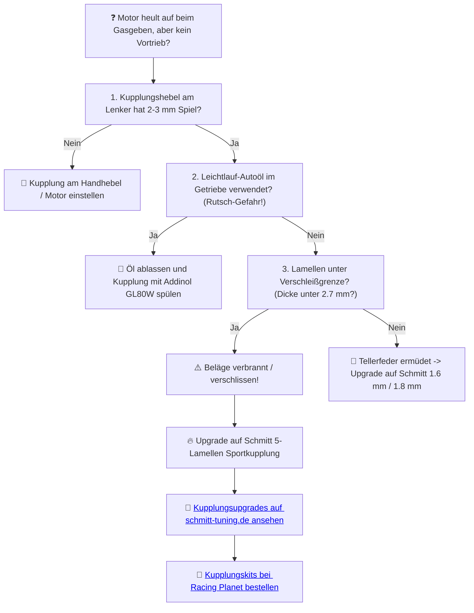

# ⚙️ Kapitel 5: Die Kupplung – Der eiserne Handschlag

  
  
  

---

## 📋 Inhaltsverzeichnis
1. [Das zahnlose Gebiss des Drossel-Antriebs](#zahnlos)
2. [Der Pakt mit dem Asphalt: Schmitt 5-Lamellen Kupplung](#pakt)
3. [Die Mechanik des Kupplungsmoments](#physik-kupplung)
4. [Diagnose: Kraftschluss-Verlust unter Volllast](#diagnose)

---

## 1. Das zahnlose Gebiss des Drossel-Antriebs
Der erste Gang rastet ein. Ich gebe Gas. Nichts passiert. Der Motor jault auf, doch der Vortrieb bleibt eine Illusion der Väter. Die alte Kupplung: Ein zahnloses Gebiss, das den Kontakt zur Realität verloren hat. 

Das Drehmoment verpufft in nutzloser Reibungswärme, während die Scheiben kläglich aneinander vorbeigleiten. Wer mit 4 Standard-Scheiben das Drehmoment eines Schmitt-Zylinders bändigen will, erntet nur Rauch und verbranntes Getriebeöl. Das ist der Pfad des Leidens.

---

## 2. Der Pakt mit dem Asphalt: Schmitt 5-Lamellen Kupplung

   
  <em>Schmitt 5-Lamellen Komplettkupplung – Aluminium-Ausführung mit verstärkter Tellerfeder.</em>

Der Befehl zur Verbindung erfolgt durch das **Schmitt 5-Lamellen Kupplungskit**.

*   **Der eiserne Griff:** Fünf anstelle von vier Scheiben vergrößern die wirksame Reibfläche um satte $25\,\%$. Kein Rutschen mehr. Jedes Newtonmeter Drehmoment wird geradewegs an das Getriebe weitergegeben.
*   **Carbonfaser-Mischung:** Die Reibbeläge widerstehen härtesten Belastungen im Ölbad. Selbst bei glühend heißem Getriebe greift die Kupplung brachial zu.

---

## 3. Die Mechanik des Kupplungsmoments

Das übertragbare Reibmoment ($M_r$) einer Nasskupplung ist kein Geheimnis, sondern berechenbare Physik:

$$M_r = \mu \cdot z \cdot r_m \cdot F_n \quad [\text{Nm}]$$

*   $\mu$: Reibbeiwert der Beläge (Schmitt Carbon = $0.14$)
*   $z$: Anzahl der Reibflächen ($10$ bei 5 Lamellen)
*   $r_m$: Mittlerer Radius der Scheibe ($0.046\,\text{m}$)
*   $F_n$: Federkraft der Tellerfeder ($1000\,\text{N}$ bei der verstärkten $1.6\,\text{mm}$ Feder)

*Berechnung für das Schmitt 5-Lamellen Kit:*
$$M_r = 0.14 \cdot 10 \cdot 0.046 \cdot 1000 = 1.4 \cdot 46 \approx 6.44\,\text{Nm}$$

> [!IMPORTANT]
> Eine Standardkupplung rutscht bereits ab $4.0\,\text{Nm}$ hoffnungslos durch. Das Schmitt Upgrade erhöht das Limit auf über **$6.4\,\text{Nm}$** – genug Reserve für das Schmitt Drehmomentwunder.

---

## 4. Diagnose: Kraftschluss-Verlust unter Volllast

Wenn deine Drehzahl im Resonanzbereich nach oben schießt, das Moped aber nicht an Geschwindigkeit gewinnt:

> [!TIP]
> Grip ist kein Zustand – es ist Gewalt gegen das Rutschen. Mama, ich lass nicht mehr los. Geh keine Kompromisse ein und rüste auf Schmitt um.
>
> ➡️ **[Jetzt Kupplungs-Erlösung auf schmitt-tuning.de sichern](https://schmitt-tuning.de/neu/produkt/kupplung.html)**
>
> ➡️ **[Direktlink zum Schmitt 5-Lamellen Kit bei Racing Planet](https://www.racing-planet.de/kupplung-paket-komplett-5-scheiben-10mm-aluminium-version-16mm-feder-fuer-simson-s51-s70-s53-s83-enduro-p-586040-1.html)**

---

[⬅️ Zurück zu Kapitel 4](chapter_04_kurbelwelle.md) | [Hauptportal 📋](../README.md) | [Nächstes Kapitel: Die Zündung ➡️](chapter_06_zuendung.md)
