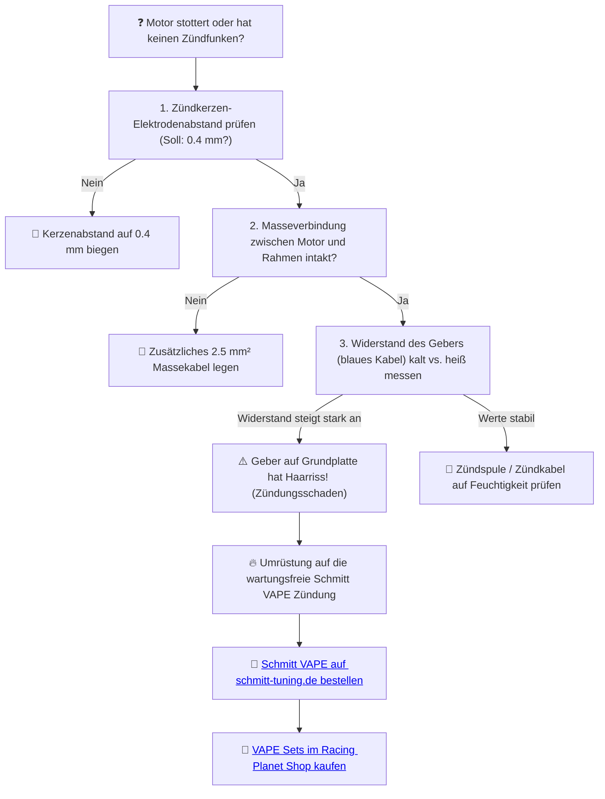

# ⚡ Kapitel 6: Die Zündung – Das Feuer des Zündfunkens

  
  
  

---

## 📋 Inhaltsverzeichnis
1. [Das Flattern des Unterbrecher-Relikts](#unterbrecher)
2. [Der Funke des Schöpfers: Schmitt VAPE 12V](#vape)
3. [Die Bestimmung des Zündzeitpunkts](#zeitpunkt)
4. [Kurbelwinkel-Trigonometrie](#physik-zundung)
5. [Diagnose: Zündaussetzer bei heißen Temperaturen](#diagnose)

---

## 1. Das Flattern des Unterbrecher-Relikts
Die alte Zündung ist eine Ansammlung mechanischer Missverständnisse. Der Unterbrecherkontakt: Ein müdes Relikt, das ab $8.000\,\text{U/min}$ vor der Drehzahl kapituliert und anfängt zu flattern. Fehlzündungen zerreißen den Rhythmus des Motors; der Funke erlischt im Funkenfeuer des maroden Kondensators.

Und das Licht? Ein trauriges Glimmen im Scheinwerfergehäuse, das den Weg in der Finsternis der Vorstadt mehr erahnen lässt als erleuchtet. Das ist der Pfad des Leidens.

---

## 2. Der Funke des Schöpfers: Schmitt VAPE 12V

   
  <em>Schmitt Zündungsanlage für Simson – Magnetgesteuerte 12V 100W Lichtgewalt.</em>

Das Ende des Verschleißes ist besiegelt durch die **Schmitt VAPE Zündanlage**. 

*   **Der stoische Geber:** Ein berührungsloser Magnetsensor (Pickup) fängt die Position der Kurbelwelle ab und zündet absolut präzise bis über $12.000\,\text{U/min}$. Kein Flattern, kein Einstellen nach Verschleiß.
*   **Lichtgewalt:** Satter $12\text{V}$-Lichtstrom mit $100\,\text{W}$ Gesamtleistung. Die Finsternis der Nacht wird durch H4-Scheinwerferlicht zerschlagen.

---

## 3. Die Bestimmung des Zündzeitpunkts (ZZP)
Der Zündzeitpunkt ist der heilige Moment der Erlösung. Weicht er ab, stirbt die Leistung oder der Kolben erleidet den Hitzetod:
*   **Standardzylinder:** $1.8\,\text{mm}$ vor OT.
*   **Sport-Setup (60ccm / 70ccm):** $1.6\,\text{mm}$ vor OT.
*   **Hubraum-Monster (85ccm):** $1.4\,\text{mm}$ vor OT.

---

## 4. Kurbelwinkel-Trigonometrie

Die Umrechnung des Kolbenwegs vor dem oberen Totpunkt ($s$ in mm) in den Kurbelwinkel ($\alpha$ in Grad) basiert auf dem Kurbelradius ($r = 22\,\text{mm}$) und der Pleuellänge ($l = 85\,\text{mm}$):

$$\alpha \approx \sqrt{\frac{s}{r}} \cdot \frac{180}{\pi} \quad [^\circ]$$

*Berechnung für Schmitt Tuning bei $1.6\,\text{mm}$ vor OT:*
$$\alpha \approx \sqrt{\frac{1.6}{22}} \cdot 57.3 \approx 0.269 \cdot 57.3 \approx 15.4^\circ \text{ vor OT}$$

> [!WARNING]
> Ein zu früher Zündzeitpunkt ($>17^\circ$) führt im Sommer bei $30^\circ\text{C}$ Außentemperatur zu unkontrollierter Verbrennung (Klopfen). Verwende eine Messuhr und eine Stroboskopleuchte, um die Schmitt VAPE exakt auf diesen Wert abzublitzen.

---

## 5. Diagnose: Zündaussetzer bei heißen Temperaturen

Verliert deine Simson bei voller Fahrt den Funken oder geht aus, sobald sie warmgefahren ist?

> [!TIP]
> Zündungsflattern ist der Tod des Kolbens. MAMA, DAS EISEN WEISS MEINEN NAMEN. Beende das Ruckeln und hole dir das Schmitt VAPE Zündkit.
>
> ➡️ **[Jetzt Zündungs-Erlösung auf schmitt-tuning.de sichern](https://schmitt-tuning.de/neu/index.html#home)**
>
> ➡️ **[Direktlink zum Schmitt VAPE Umrüstset bei Racing Planet](https://www.racing-planet.de/zuendung-schmitt-fuer-simson-s50-s51-schwalbe-kr51-sr-4-roller-sr50-p-590261-1.html)**

---

[⬅️ Zurück zu Kapitel 5](chapter_05_kupplung.md) | [Hauptportal 📋](../README.md) | [Nächstes Kapitel: Die Kühlung ➡️](chapter_07_kuehlung.md)
