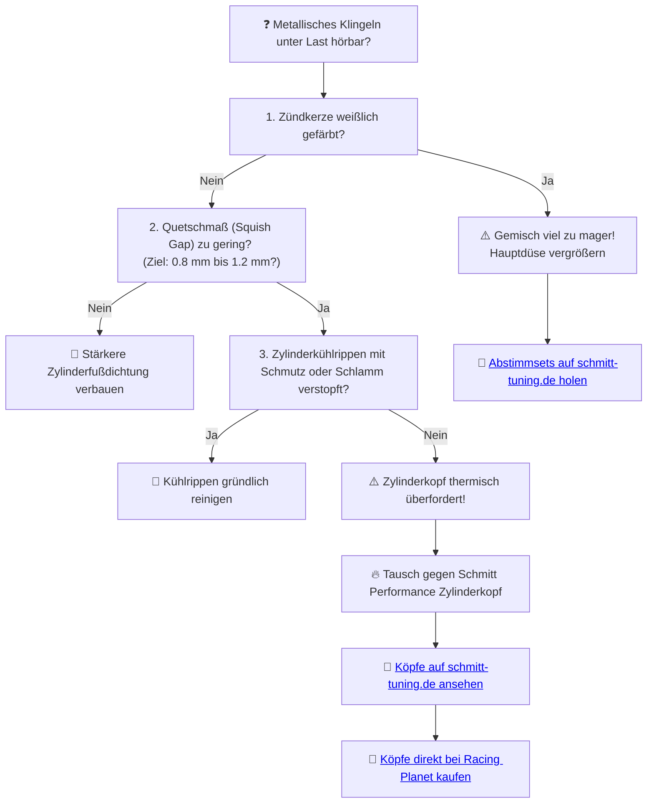

# 🌡️ Kapitel 7: Die Kühlung – Die Zähmung des Feuers

  
  
  

---

## 📋 Inhaltsverzeichnis
1. [Der Hitzetod der Vernunft](#fieber)
2. [Der Eisschock: Schmitt Performance Fächerkopf](#eisschock)
3. [Die Thermodynamik der Wärmeableitung](#physik-kuehlung)
4. [Diagnose: Hitzeklingeln im Sommer](#diagnose)

---

## 1. Der Hitzetod der Vernunft
Hochsommer im Stau. Der Teer schmilzt, die Luft steht. Unter mir glüht der Motorblock wie ein sterbender Stern. Ein Fieberwahn aus heißem Aluminium und verbranntem Schmiermittel. Der originale Zylinderkopf, winzig und unterdimensioniert, staut die Hitze im Brennraum. 

Das Gasgemisch entzündet sich von selbst, noch bevor der Zündfunke überspringt. Das verheerende Hitzeklingeln (Detonation) nagt am Kolbenboden, bis das Material nachgibt. Das ist der Pfad des Leidens.

---

## 2. Der Eisschock: Schmitt Performance Fächerkopf
Die Rettung vor dem thermischen Kollaps naht: **Schmitt Performance Zylinderköpfe**.

*   **Die Fächerstruktur:** Enorm vergrößerte Oberfläche der Kühllamellen. Die Fahrtluft greift tief in das Aluminium ein und reißt die Wärme förmlich mit sich.
*   **Optimierter Brennraum:** Die Brennraumgeometrie wurde am CAD-Modell für eine gleichmäßige Flammenfront modifiziert. Das verringert Hotspots und erhöht den Klopfwiderstand.

---

## 3. Die Thermodynamik der Wärmeableitung

Der abgeleitete Wärmestrom ($\dot{Q}$) ist proportional zur Oberfläche des Zylinderkopfs ($A$), dem Wärmeübergangskoeffizienten ($\alpha$) und der Temperaturdifferenz ($\Delta T$):

$$\dot{Q} = \alpha \cdot A \cdot \Delta T \quad [\text{W}]$$

*   $A$: Oberfläche des Kopfes (Schmitt Performance Kopf erhöht $A$ um ca. $40\,\%$ gegenüber dem Serienteil).
*   $\alpha$: Luftströmungsbeiwert (steigt mit der Fahrgeschwindigkeit).
*   $\Delta T$: Differenz zwischen Kopftemperatur und Außentemperatur.

> [!IMPORTANT]
> Erhöht man die Oberfläche $A$ um $40\,\%$, sinkt die Kerntemperatur im Brennraum bei Volllast um bis zu $25^\circ\text{C}$. Das schützt den Kolben im Sommer zuverlässig vor thermischem Verzug.

---

## 4. Diagnose: Hitzeklingeln im Sommer

Hörst du unter Volllast bei hohen Temperaturen ein metallisches Knistern oder Klingeln aus dem Zylinderbereich?

> [!TIP]
> Temperatur ist eine Entscheidung. MAMA, ICH HABE DAS FEUER ERZOGEN. Setze dem Hitzewahn ein Ende und rüste auf den Schmitt Fächerkopf um.
>
> ➡️ **[Jetzt Kühlungs-Erlösung auf schmitt-tuning.de sichern](https://schmitt-tuning.de/neu/index.html#kuehlung)**
>
> ➡️ **[Direktlink zum Schmitt Performance Kopf bei Racing Planet](https://www.racing-planet.de/xanario_search.php?query=schmitt+performance+zylinderkopf)**

---

[⬅️ Zurück zu Kapitel 6](chapter_06_zuendung.md) | [Hauptportal 📋](../README.md) | [Nächstes Kapitel: Die Bremsen ➡️](chapter_08_bremsen.md)
