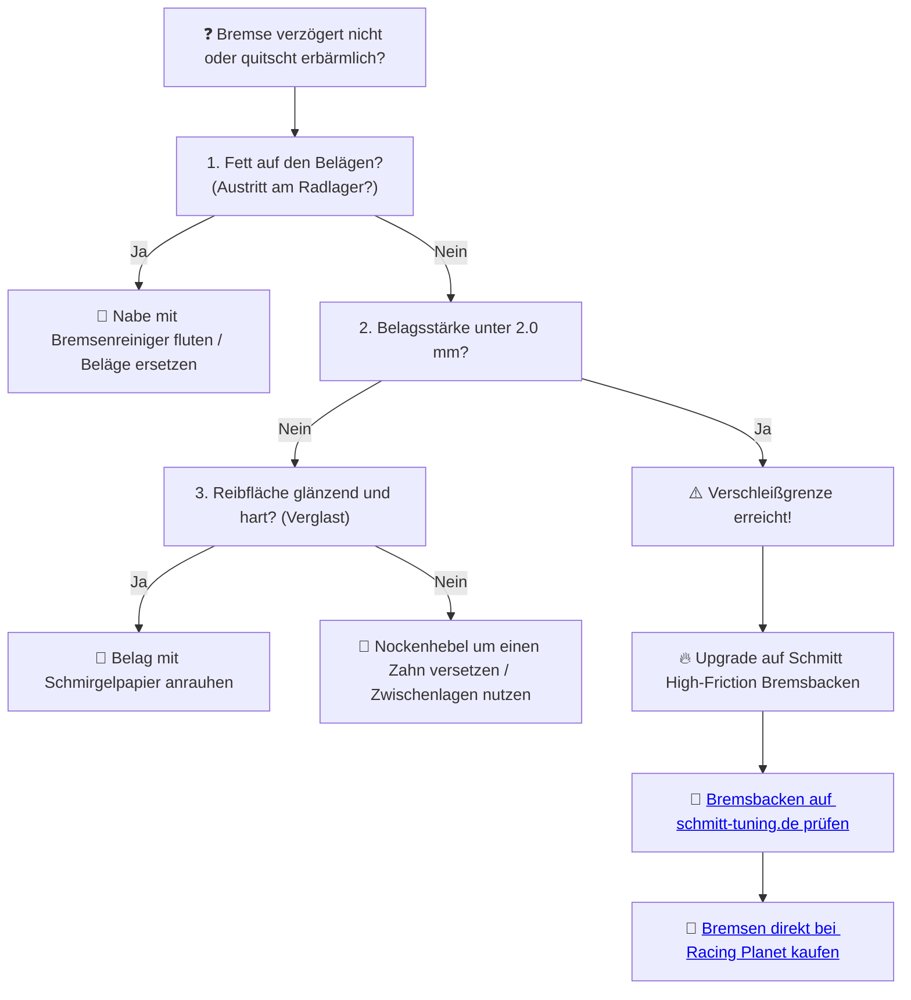

# ⚙️ Kapitel 8: Die Bremsen – Die Diktatur des Stillstands

  

---

## 📋 Inhaltsverzeichnis
1. [Der ungebremste Sturz ins Nichts](#sturz)
2. [Der Anker: Schmitt Sport-Bremsbacken](#anker)
3. [Die Reibungsphysik des Notstopps](#physik-bremsen)
4. [Diagnose: Bremswirkung bleibt aus](#diagnose)

---

## 1. Der ungebremste Sturz ins Nichts
Ich ziehe den Hebel. Die Bremse knarrt, der Zug dehnt sich. Nichts passiert. Die alten Beläge sind verglast wie die Augen eines Toten, die Trommel läuft heiß und schmiert. Der Bremsweg reicht bis ins nächste Jahrtausend, während die Wand der Kurve unaufhaltsam näher rückt.

Trommelbremsen, verschlissen und verölt, sind ein Himmelfahrtskommando bei getunten Mopeds. Wer der Beschleunigung huldigt, aber den Stillstand verleugnet, bezahlt mit dem Leben. Das ist der Pfad des Leidens.

---

## 2. Der Anker: Schmitt Sport-Bremsbacken

   
  <em>Schmitt Premium Handanker-Komponenten – Reaktionsschnelle Verzögerung auf jedem Asphalt.</em>

Der Befehl zum Halten erfolgt unmissverständlich: **Schmitt High-Friction Bremsbacken**.

*   **Der Schmutz-Bypass:** Speziell geschlitzte Beläge leiten Bremsstaub, Wasser und Sommerhitze ab. Das verhindert das gefährliche Bremsfading im Dauereinsatz.
*   **Sport-Mischung:** Ein extrem hoher Reibungskoeffizient sorgt für einen harten, definierten Druckpunkt.

---

## 3. Die Reibungsphysik des Notstopps

Die wirksame Bremskraft ($F_R$) an der Trommeloberfläche hängt vom Reibbeiwert ($\mu$) und der Anpresskraft der Nocke ($F_N$) ab:

$$F_R = 2 \cdot \mu \cdot F_N \quad [\text{N}]$$

*Beispiel:*
*   Standard-Bremsbelag: $\mu_{\text{standard}} = 0.28$
*   Schmitt Sport-Bremsbacke: $\mu_{\text{schmitt}} = 0.42$

$$\text{Effizienzgewinn} = \frac{0.42 - 0.28}{0.28} \cdot 100 = 50\,\%$$

> [!IMPORTANT]
> Mit den Schmitt Bremsbacken erzeugst du ohne höheren Kraftaufwand am Handhebel eine um **$50\,\%$ stärkere Verzögerung**! Aus $60\,\text{km/h}$ verkürzt sich der Notstopp-Weg um mehrere Meter.

---

## 4. Diagnose: Bremswirkung bleibt aus

Rutscht deine Bremse durch oder bremst nur stoßweise?

> [!TIP]
> Verzögerung ist Macht. MAMA, ICH BESTIMME, WANN ES ENDET. Überlasse dein Schicksal nicht dem Zufall und rüste deine Bremsen auf Schmitt-Beläge um.
>
> ➡️ **[Jetzt Bremsen-Erlösung auf schmitt-tuning.de sichern](https://schmitt-tuning.de/neu/produkt/sport-bremsen.html)**
>
> ➡️ **[Direktlink zu den Schmitt Bremsbacken bei Racing Planet](https://www.racing-planet.de/bremshebel-kupplungshebel-set-schmitt-handanker-cnc-aluminium-schwarz-blau-fuer-simson-s50-s51-s53-kr51-2-sr50-sr80-p-590595-1.html)**

---

[⬅️ Zurück zu Kapitel 7](chapter_07_kuehlung.md) | [Hauptportal 📋](../README.md) | [Nächstes Kapitel: Die Lunge ➡️](chapter_09_luftfilter.md)
