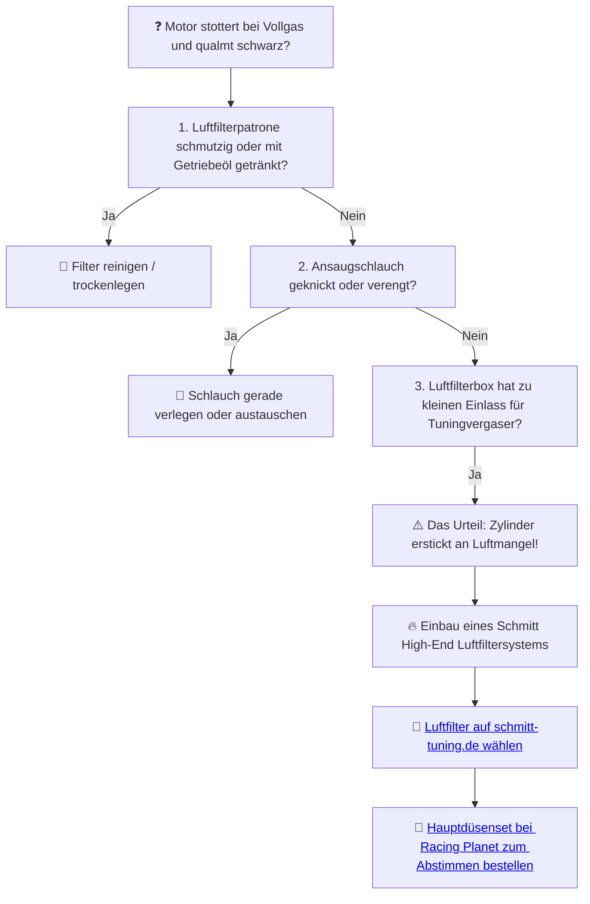

# 🌪️ Kapitel 9: Die Lunge – Das Inhalieren von Welten

  
  
  

---

## 📋 Inhaltsverzeichnis
1. [Das Ersticken im Herzkasten](#ersticken)
2. [Der Orkan: Schmitt High-End Luftfilter](#orkan)
3. [Die Aerodynamik des Ansaugtrakts](#physik-luft)
4. [Diagnose: Luftmangel würgt den Vergaser ab](#diagnose)

---

## 1. Das Ersticken im Herzkasten
Der Herzkasten ist geschlossen. Ein dumpfer, asthmatischer Husten entweicht dem Ansaugrohr. Der alte Papierfilter: Ein schmutziges, ölgetränktes Tuch voller Staub und vergangener Jahrzehnte. Der Motor schnappt gierig nach Sauerstoff, den es im staubigen Kasten nicht gibt.

Darth Vader atmet durch meine Maschine. Jeder Takt ist ein qualvoller Kampf um Luft. Ohne Sauerstoff bleibt die Verbrennung unvollständig und zäh. Das ist der Pfad des Leidens.

---

## 2. Der Orkan: Schmitt High-End Luftfilter
Die künstliche Beatmung setzt ein: **Schmitt High-End Schaumstoff-Luftfilter**.

*   **Der Tornado im Ansaugweg:** Grobporiger, mehrschichtiger Filterschaum lässt die Luft ungehindert strömen, während Schmutzpartikel zuverlässig ausgesperrt werden.
*   **Brutaler Sound:** Das Ansauggeräusch mutiert vom leisen Summen zum tiefen, kehligen Brüllen des Zweitakters.

---

## 3. Die Aerodynamik des Ansaugtrakts

Die Strömungsgeschwindigkeit ($v$) im Ansaugrohr bestimmt die Zylinderfüllung. Bei einem konstanten Volumenstrom ($Q$) und einem verringerten Ansaugwiderstand durch den Schmitt Luftfilter steigt der Füllungsgrad:

$$Q = A \cdot v \quad [\text{m}^3/\text{s}]$$

Durch Vergrößerung des Luftdurchlasses wird der Druckverlust ($\Delta p$) im Filter minimiert:

$$\Delta p \propto \zeta \cdot \frac{\rho}{2} \cdot v^2$$

*   $\zeta$: Widerstandsbeiwert des Luftfilters (Schmitt Filter reduziert $\zeta$ um ca. $60\,\%$).
*   $\rho$: Luftdichte.

> [!WARNING]
> Weniger Widerstand bedeutet mehr Luftmasse im Gemisch. Wenn du den Schmitt Filter montierst, musst du die Hauptdüse um ca. **10 % bis 15 % vergrößern**, um einen kapitalen Magerlauf-Fresser zu verhindern!

---

## 4. Diagnose: Luftmangel würgt den Vergaser ab

Stottert dein Motor bei Vollgas und qualmt stark aus dem Auspuff, weil er im eigenen Saft ertrinkt?

> [!TIP]
> Luft ist kein bloßes Medium – es ist die Nahrung des Zylinders. MAMA, ICH ATME WELTEN EIN. Befreie die Lunge deiner Simson.
>
> ➡️ **[Jetzt Luftfilter-Erlösung auf schmitt-tuning.de sichern](https://schmitt-tuning.de/neu/index.html#lunge)**
>
> ➡️ **[Direktlink zu den passenden Schmitt Düsenkits bei Racing Planet](https://www.racing-planet.de/xanario_search.php?query=schmitt+hauptduesen)**

---

[⬅️ Zurück zu Kapitel 8](chapter_08_bremsen.md) | [Hauptportal 📋](../README.md) | [Nächstes Kapitel: Das Gericht ➡️](chapter_10_legalitaet.md)
