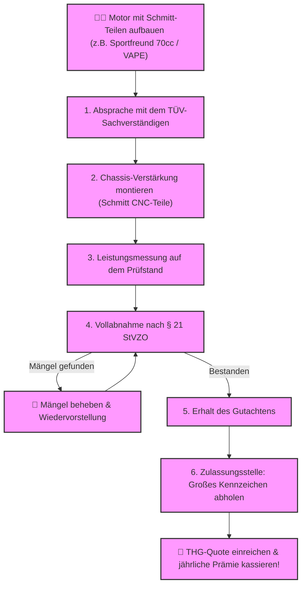

# ⚖️ Kapitel 10: Das Gericht – Der Tanz vor dem Richter

  
  
  

---

## 📋 Inhaltsverzeichnis
1. [Die Furcht vor der Kontrolle](#furcht)
2. [Die legale Metamorphose zum Leichtkraftrad](#zulassung)
3. [Die Bremsprüfung auf dem Prüfstand](#physik-tuev)
4. [Der ehrbare Pfad der Abnahme](#flowchart)

---

## 1. Die Furcht vor der Kontrolle
Blaulicht spiegelt sich im nassen Asphalt der Landstraße. Der Griff der Behörden ist kalt und unbarmherzig. Wer mit einer illegal getunten Simson die 60-km/h-Grenze überschreitet, tanzt am Rande des Abgrunds. Fahren ohne Fahrerlaubnis, Erlöschen der Betriebserlaubnis, Versicherungsbetrug – ein eiserner Richterspruch wartet auf den Unachtsamen.

Tuning im Verborgenen ist eine ständige Furcht vor der Entdeckung. Das ist der Pfad des Leidens.

---

## 2. Die legale Metamorphose zum Leichtkraftrad
Wir wählen den Pfad der Offenheit: **Die Einzelabnahme nach § 21 StVZO**.

Mit dem Schmitt-Zylinder und der passenden Chassis-Versteifung mutiert dein Moped legal zum Leichtkraftrad. Kein Verstecken mehr, keine Angst vor Kontrollen. Fahrbar mit B196 oder A1.

*   **Der Stempel der Obrigkeit:** Der Prüfer sieht die eingetragenen Leistungsdaten schwarz auf weiß. Das Moped erhält ein großes Kennzeichen, verlässt die rechtliche Grauzone und wird vollkommen straßenlegal.
*   **Die THG-Prämie:** Als Leichtkraftrad zugelassen, refinanziert sich der Umbau durch die jährliche Treibhausgasquote fast von allein.

---

## 3. Die Bremsprüfung auf dem Prüfstand

Bei der Fahrprüfung für die Einzelabnahme muss das Fahrzeug eine definierte Verzögerung ($a$) erbringen, um die Bremsstabilität nachzuweisen:

$$a = \frac{v^2}{2 \cdot s} \quad [\text{m/s}^2]$$

*   $v$: Bremsausgangsgeschwindigkeit in m/s
*   $s$: Gemessener Bremsweg in Metern

*Berechnung bei einer Vollbremsung aus $80\,\text{km/h} \approx 22.22\,\text{m/s}$ bei einem Bremsweg von $42\,\text{Metern}$ mit Schmitt Sport-Belägen:*
$$a = \frac{22.22^2}{2 \cdot 42} = \frac{493.72}{84} \approx 5.87\,\text{m/s}^2$$

> [!IMPORTANT]
> Der Gesetzgeber verlangt eine Mindestverzögerung von $4.0\,\text{m/s}^2$ für Leichtkrafträder. Mit $5.87\,\text{m/s}^2$ nimmt dein Moped die Hürde des Prüfstands mit Bravour.

---

## 4. Der ehrbare Pfad der Abnahme

Der Ablauf zur Erlangung der legalen Betriebserlaubnis als Leichtkraftrad:

> [!TIP]
> MAMA, SIE WISSEN NICHT, WAS ICH BIN. Aber der TÜV-Prüfer wird es absegnen. Bereite deine Simson auf die Einzelabnahme vor und montiere Schmitt Verstärkungsteile.
>
> ➡️ **[Jetzt Zulassungs-Erlösung auf schmitt-tuning.de sichern](https://schmitt-tuning.de/neu/index.html#home)**
>
> ➡️ **[Verstärkungsteile und CNC-Komponenten im Racing Planet Shop ansehen](https://www.racing-planet.de/xanario_search.php?query=schmitt+cnc)**

---

[⬅️ Zurück zu Kapitel 9](chapter_09_luftfilter.md) | [Hauptportal 📋](../README.md)
